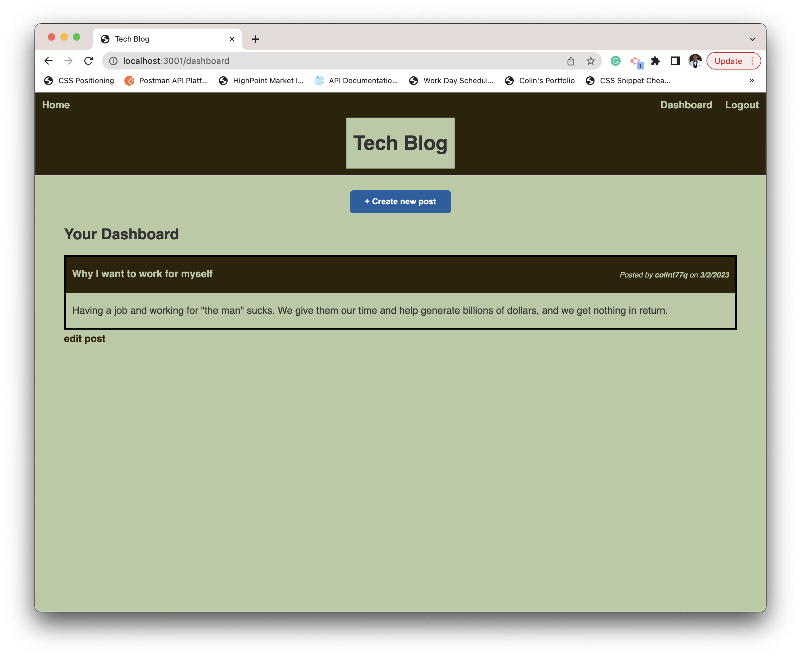

# Tech Blog

  

  ## Table-of-Contents

  * [Description](#description)
  * [Installation](#installation)
  * [Usage](#usage)
  * [License](#license)
  * [Contributing](#contributing)
  * [Tests](#tests)
  * [Questions](#questions)
  
  ## [Description](#table-of-contents)

  This application utilizes Node, Express, dotenv, MYSQl2, Sequelize, and handlebars to provide a blog website that allows users to see posts from other users, create their own post, edit and delete their post, and comment on others (or their own) posts.

  ## [Installation](#table-of-contents)

  To install this project, clone the repository, run npm install, create and select a databse in MYSQL, and run npm start then go to localhost 3001. 

  ## [Usage](#table-of-contents)

  To use this application, follow this link: 

  Here is an image of what the application should look like: 
  
   

  ## [Contributing](#table-of-contents)
  
  
    Thank you for your interest contributing; however, right now, I will not be accepting outside contributions.
      

  ## [Questions](#table-of-contents)

  Please contact me using the following links:

  [GitHub](https://github.com/colint771)

  [Email: colint771@gmail.com](mailto:colint771@gmail.com)
